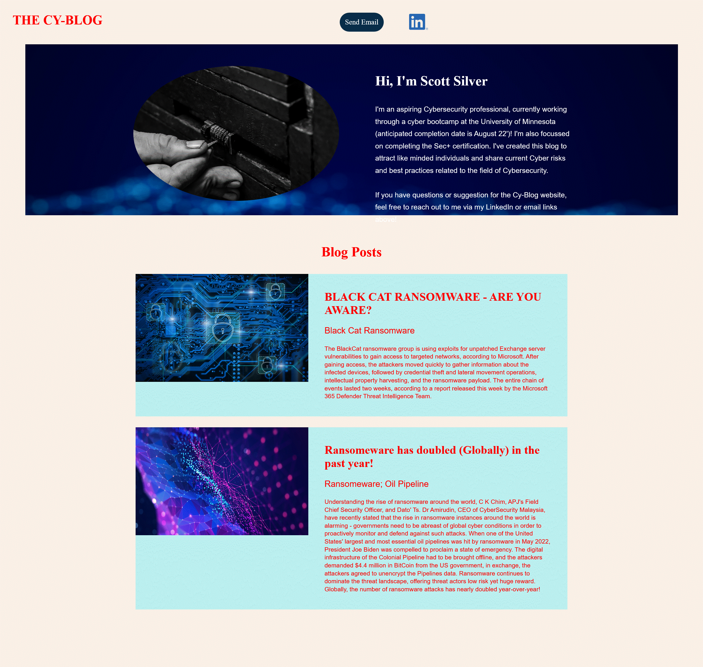

# SSILVER-BLOG

## Welcome to my blog

Here's the link to my blog:

[Click Here Blog](https://ssilver-blog.azurewebsites.net)

## This is the html code for my blog:

<!DOCTYPE html>
<html lang="en">

<head>
    <meta charset="UTF-8" />
    <title>My Blog</title>
    <link rel="stylesheet" href="./assets/css/style.css" />
</head>

<body>
    <!-- navigation -->
    <header>
        <h1>
            <a href="/">
            
                THE CY-BLOG
            </a>
        </h1>
        <a href="mailto:ssilver68@gmail.com" class="button">Send Email</a>
        
    <header>

    <!-- "About" section -->
    <section id="about" class="intro">
        <!--Replace with your own image-->
        
        <h2 class="section-title">Hi, I'm Scott Silver</h2>
        

            I'm an aspiring Cybersecurity professional, currently working through a cyber bootcamp at the University of Minnesota
            (anticipated completion date is August 22')! I'm also focussed on completing the Sec+ certification.  I've created this blog to
            attract like minded individuals and share current Cyber risks and best practices related to the field of Cybersecurity.
              
            If you have questions or suggestion for the Cy-Blog website, feel free to reach out to me via my LinkedIn or email links above!
        

    </section>

    <!-- "Blog Posts" section -->
    <section id="blog-post-collection" class="blog-posts">
        <h2 class="section-title">Blog Posts</h2>
        <article class="blog-post">
            

            

                <h3>BLACK CAT RANSOMWARE - ARE YOU AWARE?</h3>
                <h4>Black Cat Ransomware</h4>
                
The BlackCat ransomware group is using exploits for unpatched Exchange server vulnerabilities to gain access to targeted networks, according to Microsoft.
                   After gaining access, the attackers moved quickly to gather information about the infected devices, followed by credential theft and lateral movement operations,
                   intellectual property harvesting, and the ransomware payload.  The entire chain of events lasted two weeks, according to a report released this week by the
                   Microsoft 365 Defender Threat Intelligence Team.
                

            

        </article>
    

        <!-- second blog post -->
        <article class="blog-post">
            
            

                <h3>Ransomeware has doubled (Globally) in the past year!</h3>
                <h4>Ransomeware; Oil Pipeline</h4>
                

                 Understanding the rise of ransomware around the world, C K Chim, APJ's Field Chief Security Officer, and Dato' Ts. Dr Amirudin, CEO of CyberSecurity Malaysia,
                 have recently  stated that the rise in ransomware instances around the world is alarming - governments need to be abreast of global cyber conditions in order to
                 proactively monitor and defend against such attacks.  When one of the United States' largest and most essential oil pipelines was hit by ransomware in May 2022,
                 President Joe Biden was compelled to proclaim a state of emergency. The digital infrastructure of the Colonial Pipeline had to be brought offline, and the attackers
                 demanded $4.4 million in BitCoin from the US government, in exchange, the attackers agreed to unencrypt the Pipelines data.  Ransomware continues to dominate
                 the threat landscape, offering threat actors low risk yet huge reward. Globally, the number of ransomware attacks has nearly doubled year-over-year!
                

            

        </article>
    </section>
</body>

</html>

## This is the CSS for my blog:

* {
  margin: 0;
  padding: 0;
  box-sizing: border-box;
}

body {
  font-family: Helvetica;
  color: #082D49
}

a{
  text-decoration: none;
  color: #082D49
}

/* apply styles to <header> */
header {
  padding: 35px 35px;
  background-color: Linen;
}

header h1 {
  font-family: Gopher;
  font-weight: bold;
  font-size: 36px;
  color: #082D49;
  margin: 0;
  display: inline;
}
header a {
  text-decoration: none;
  color: #082D49;
}

.button{
  background-color: #082D49;
  font-family: Gopher;
  color: white;
  padding: 15px 15px;
  text-align: center;
  text-decoration: none;
  display: inline-block;
  font-size: 20px;
  cursor: pointer;
  border-radius: 50px;
  margin-left: 650px;
}

.button:hover{
  background-color: #031119;
  font-family: Gopher;
  color: white;
  padding: 15px 15px;
  text-align: center;
  text-decoration: none;
  display: inline-block;
  font-size: 20px;
  cursor: pointer;
  border-radius: 50px;
  margin-left: 650px;
}

.linkedin{
  position:absolute;
  cursor: pointer;
  margin-left: 70px;
  margin-top: 3px;
}

.linkedin:hover{
  filter:contrast(200%) brightness(40%);
}

/* Hero Style Start */
.intro {
  background-image: url("https://drive.google.com/uc?export=view&id=1jPkt3OSxC3tQZMdYEcZudTT1yO4gSfZx");  
  height: 475px;
  position: center;
  background-repeat: no-repeat;
  background-size: cover;
  padding-left: 300px;
  padding-right: 150px;

}

.intro img{
  border-radius: 50%;
  float: left;
  display:inline-block;
  margin-right: 100px;
  margin-bottom: 100px;
}

.intro {
  color: #ffffff;
  text-align: left;

}

.intro p {
  line-height: 1.7;
  color: #ffffff;
  width: 80%;
  font-weight: lighter;
  font-size: 20px;
  
  margin: 0 auto;
  text-align: left;
}

/* Hero Style end */

section {
  padding: 60px;
}

.section-title {
  font-family: Gopher;
  font-size: 38px;
  margin-top: 20px;
  margin-bottom: 40px;
  padding: -10px 100px 20px 100px;
  display: inline-block;
}

.blog-posts {
  text-align: center;
}

.blog-post {
  width: 1200px;
  margin: 0 auto 30px auto;
  background: #BBEFEF;
  overflow: auto;
}

.blog-post img {
  height:300px;
  width: 40%;
  float: left;
}

.blog {
  padding: 45px;
  float: left;
  width: 60%;
  text-align: left;

}

.blog h3 {
  font-weight: bold; 
  font-family: Gopher;
  font-size: 32px;
  margin-bottom: 8px;
}

.blog h4 {
  font-weight: lighter;
  font-size: 24px;
  margin-top: 25px;
  margin-bottom: 25px;
}

.blog p {
  font-weight: lighter;
  font-size: 17px;
  line-height: 1.3;

